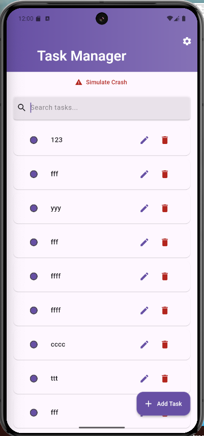
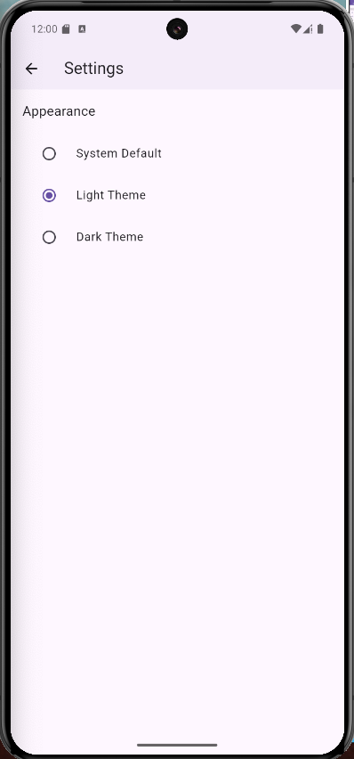
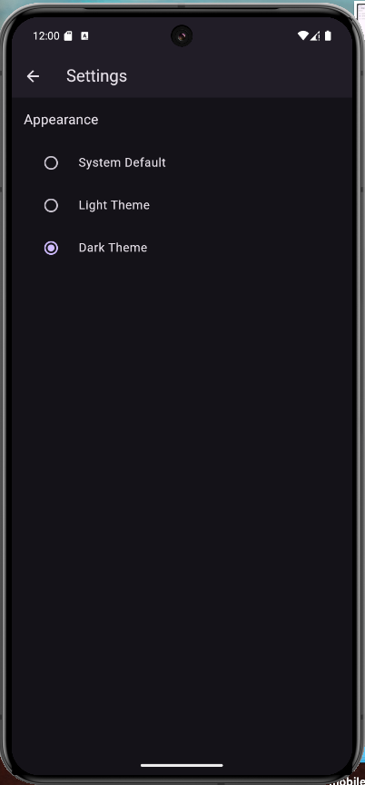

```markdown
# Task Manager App

A feature-rich Flutter task management application following Clean Architecture principles with Firebase integration and test-driven development.






## Features

- **Task Management**
  - Create, Read, Update, Delete (CRUD) tasks
  - Mark tasks as complete/incomplete
  - Persistent local storage
  - Search functionality
  - Swipe to delete

- **User Interface**
  - Light/Dark theme support
  - Responsive design
  - Animated transitions
  - Clean Material Design

- **Analytics & Monitoring**
  - Firebase Analytics integration
  - Crashlytics error reporting
  - User interaction tracking

- **Quality Assurance**
  - Test-Driven Development (TDD)

- **Advanced Features**
  - Clean Architecture implementation
  - State management with Cubit
  - Dependency injection
  - Adaptive theme system

## Tech Stack

- **Flutter** 3.27.3
- **Dart** 3.6.1
- **Firebase**
  - Analytics
  - Crashlytics
- **State Management**: Flutter Bloc/Cubit
- **Local Storage**: SharedPreferences
- **Testing**: Mocktail, Bloc Test, Golden Tests
- **Additional Packages**:
  - adaptive_theme
  - equatable
  - get_it
  - injectable
  - uuid

## Installation

### Prerequisites
- Flutter 3.27.3
- Dart 3.6.1
- Android Studio/Xcode (for mobile builds)
- Firebase account

### Steps
1. Clone the repository:
   ```bash
   git clone https://github.com/saqrelfirgany/dash_code.git
   cd task-manager-app
   ```

2. Install dependencies:
   ```bash
   flutter pub get
   ```

3. Firebase Setup:
    - Create Firebase project at [console.firebase.google.com](https://console.firebase.google.com/)
    - Add Android/iOS apps and download configuration files:
        - `android/app/google-services.json`
        - `ios/Runner/GoogleService-Info.plist`

4. Run the app:
   ```bash
   flutter run
   ```

## Configuration

### Firebase Integration
1. Enable Analytics and Crashlytics in Firebase Console
2. Add API keys to appropriate platform files
3. Configure crash reporting in `main.dart`:
   ```dart
   FlutterError.onError = FirebaseCrashlytics.instance.recordFlutterFatalError;
   PlatformDispatcher.instance.onError = ...;
   ```

### Theming
Edit theme configurations in:
```
lib/core/theme/
└── app_theme.dart
```

## Running Tests

```bash
# Run all tests
flutter test

# Generate test coverage
flutter test --coverage
genhtml coverage/lcov.info -o coverage/
open coverage/index.html

# Run specific test group
flutter test --plain-name "Task Cubit Tests"
```

## Folder Structure

```
lib/
├── core/
│   ├── constants/
│   ├── theme/
│   ├── utils/
│   └── dependency_injection/
├── data/
│   ├── datasources/
│   ├── models/
│   └── repositories/
├── domain/
│   ├── entities/
│   ├── repositories/
│   └── usecases/
└── presentation/
    ├── cubit/
    └── pages/
test/ # Mirror of lib structure
```

## Development Setup

### Code Generation
```bash
# Generate dependency injection files
flutter pub run build_runner build --delete-conflicting-outputs

# Generate mock files
flutter pub run build_runner build
```

### Coding Standards
- Follow BLoC pattern for state management
- Maintain 1:1 test-to-code ratio
- Use Dart analysis options:
  ```yaml
  include: package:flutter_lints/flutter.yaml
  ```

## Contributing

1. Fork the repository
2. Create feature branch (`git checkout -b feature/amazing-feature`)
3. Commit changes (`git commit -m 'Add amazing feature'`)
4. Push to branch (`git push origin feature/amazing-feature`)
5. Open Pull Request

## Credits

- Developed by [saqrelfirgany]
- UI Design inspired by DeepSeek
- State management with [flutter_bloc](https://bloclibrary.dev/)
- Analytics powered by [Firebase](https://firebase.google.com/)

---

**Flutter Version Details**
```
Flutter 3.27.3 • channel stable • https://github.com/flutter/flutter.git
Framework • revision c519ee916e (3 months ago) • 2025-01-21 10:32:23 -0800
Engine • revision e672b006cb
Tools • Dart 3.6.1 • DevTools 2.40.2
```
